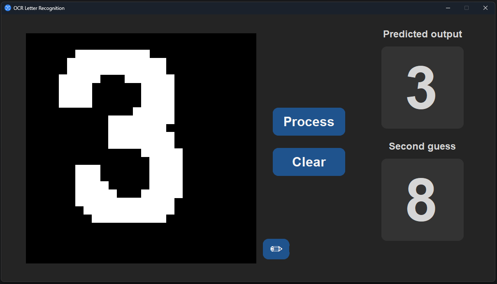

# Text Scanner #

A project implementing an **OCR (Optical Character Recognition)** neural network
in Python. The app uses OCR technology to recognize characters in the image and 
convert them into editable text.

It is a university project of ours for Artificial Intelligence course 
at Gdańsk University of Technology.

# Features #

- Recognizes handwritten letters by drawing them in a window
- Uses **OCR** technology to recognize the letter
- Displays the recognized letter next to the drawn letter

# Usage #

To use the app, simply just open it and draw a letter in the drawing window.
The app will then process the image of the letter and get the corresponding 
letter recognized by the system. The recognized letter will be shown next to 
the drawn one.

# Installation #

- Clone this repository
- Install libraries from _**requirements.txt**_ file if they are not already installed. 
- Run the app

# Requirements #

All requirements are listed in _**requirements.txt**_ file.

# Future ideas #
- Perspective of upgrading it to scan the whole text.

# Credits #
This app was developed by:

- Bartosz Bartczak
- Rafał Jankowski
- Kacper Kujawa

The machine learning model was trained on the [MNIST](https://www.kaggle.com/datasets/hojjatk/mnist-dataset) dataset.